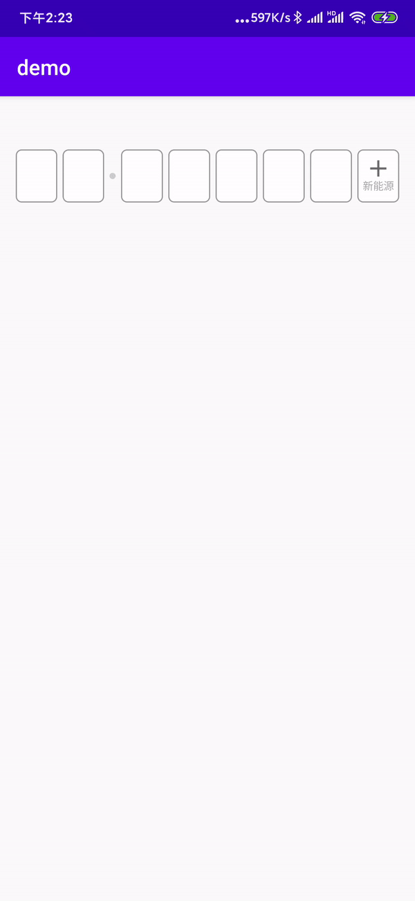

# plateNum
一个选择车牌号组件

简单使用：

~~~xm
<com.zhaopanlong.platenum.PlateNumView
    android:layout_width="match_parent"
    android:layout_height="50dp"
    app:pnvTextSize="18dp"
    app:pnvShowProvince="true"
    app:pnvTextColor="@color/colorPrimary"
    app:pnvLineNormalColor="@color/colorAccent"
    app:pnvLineCheckedColor="@color/colorPrimary"
    app:pnvitemMargin="10dp"
    app:pnvLineWidth="2dp"
    />
~~~

获取车牌号

``` java
  plateNumView.getPlateNum();
```

设置默认车牌号

~~~ java
plateNumView.setPlateNum(String plateNum);
~~~

默认清除车牌号，指示器会跑到第一个省份选项，并展示省份选择键盘

~~~ jav
plateNumView.clearPlateNum();
~~~

hidleKeyBoard 是否隐藏键盘，如果为true 指示器跑到第一个位置 不弹出省份键盘选择

~~~ java
plateNumView.clearPlateNum(boolean hidleKeyBoard);
~~~

# gradle

~~~ java
dependencies {
	        implementation 'com.github.zhaopanlong:plateNum:1.1'
	}
~~~


# 效果图




## Attributes

| name                | format    | description            |
| ------------------- | --------- | ---------------------- |
| pnvTextColor        | color     | 车牌文字颜色           |
| pnvTextSize         | dimension | 车牌文字大小           |
| pnvLineNormalColor  | color     | 车牌边框未选中状态颜色 |
| pnvLineCheckedColor | color     | 车牌边框选中状态颜色   |
| pnvLineWidth        | dimension | 边框的宽度             |
| pnvitemMargin       | dimension | 文字间距               |
| pnvShowProvince     | boolean   | 是否默认展示省份选择框 |